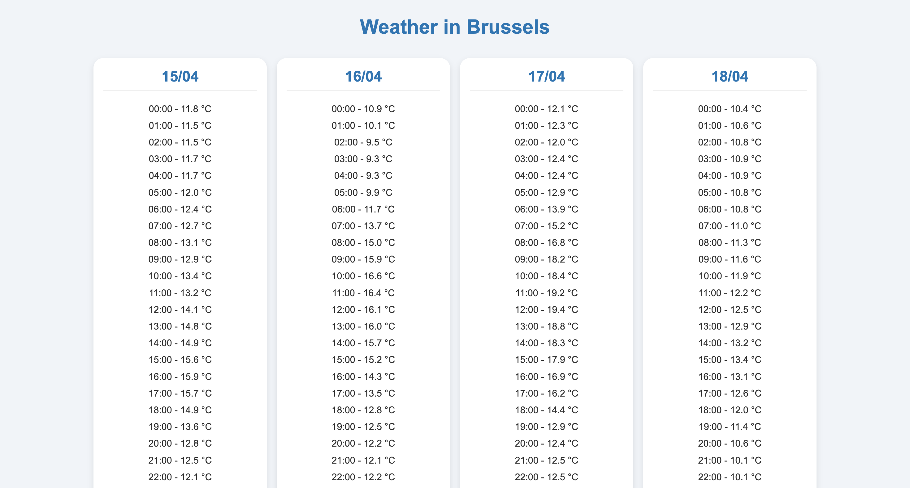

# 🌤️ Weather in Brussels

This is a simple front-end web project that displays the hourly weather forecast for Brussels over multiple days using a clean and responsive card layout.

## 📋 Features

- Hourly temperature data for multiple days
- Responsive layout using CSS Flexbox
- Clean and modern card design
- Hover animation for cards

## 📸 Screenshots

## 🛠️ Technologies Used

- HTML5
- CSS3 
- JavaScript 
- [Free Weather API](https://open-meteo.com/) for live meteo data